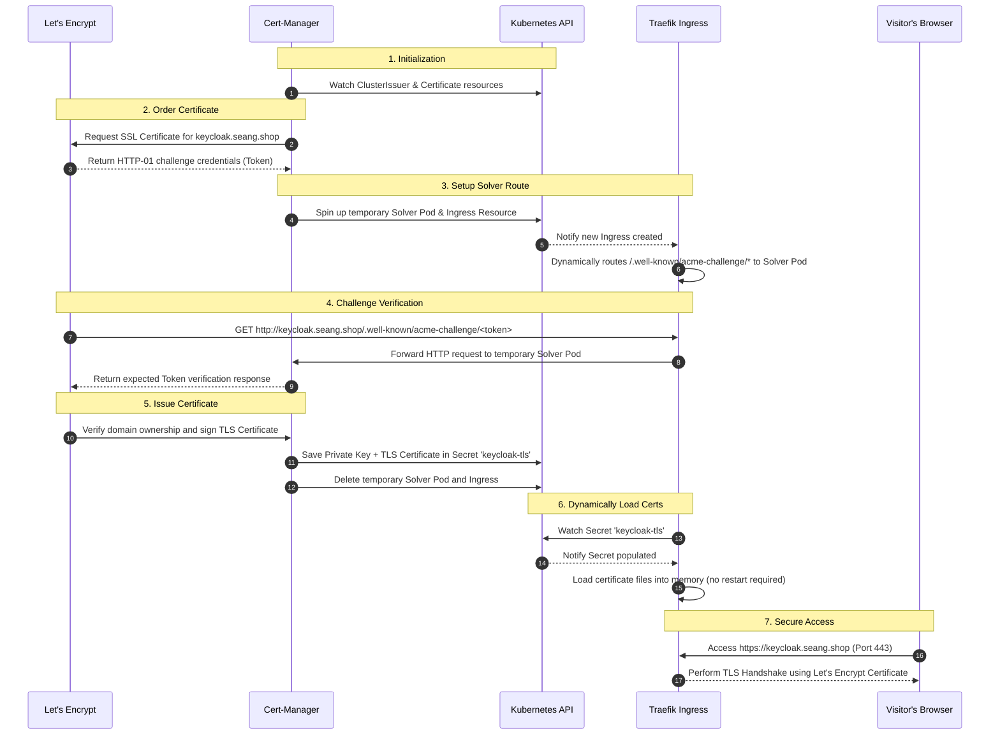

# Nextcloud NFS Cluster with Keycloak Authentication

This repository contains Helm charts and Kubernetes manifests to deploy a High-Availability (HA) Cloud Storage Platform (Nextcloud) backed by a clustered NFS storage class, integrated with Keycloak OAuth2 SSO authentication via OAuth2-Proxy.

## Deployment Components

1. **[Traefik Ingress Controller](traefik-deployment.md)**: Configured as a DaemonSet to handle incoming HTTP/HTTPS traffic directly via node ports.
2. **[Keycloak & OAuth2-Proxy Authentication Stack](keycloak-Oauth2-proxy/)**: Handles OIDC Single Sign-On (SSO) authentication for Nextcloud.
3. **[Nextcloud Application Deployment](nextcloud-deployment/)**: Multi-replica Nextcloud app backed by MariaDB, Redis, and MinIO storage.

---

## TLS Certificate Flow (Traefik + cert-manager)

The sequence below details how a certificate is requested, validated, issued, and served securely:

### Detailed Step-by-Step Walkthrough

1. **Deploying the Infrastructure (`ClusterIssuer`)**:
   We configure a `ClusterIssuer` (referencing your email and Let's Encrypt ACME URL). Cert-manager reads this global config to establish a secure account session with Let's Encrypt.
2. **Declaring the Request (`Certificate`)**:
   The Helm chart deploys a `Certificate` Custom Resource. It references the domain `keycloak.seang.shop` and specifies the target Kubernetes Secret (`keycloak-tls`).
3. **Creating the Let's Encrypt Order**:
   Cert-manager detects the `Certificate` resource and triggers a request to Let's Encrypt. Let's Encrypt responds with a unique challenge token to prove domain ownership.
4. **Deploying the Solver**:
   Cert-manager spins up a temporary Web Server pod (called the `solver pod`) and creates a temporary `Ingress` rule in Kubernetes.
5. **Configuring the Ingress Controller**:
   Traefik detects the temporary `Ingress` rule and automatically updates its routing tables to map requests on path `/.well-known/acme-challenge/*` directly to the solver pod.
6. **Verifying Domain Ownership**:
   Let's Encrypt servers make an HTTP request to `http://keycloak.seang.shop/.well-known/acme-challenge/<token>`. Traefik routes this request to the solver pod. The pod responds with the correct validation token, proving you control the domain's DNS.
7. **Saving the Certificate**:
   Let's Encrypt confirms validation, signs the TLS certificate, and returns it. Cert-manager stores the TLS certificate and private key inside the target secret (`keycloak-tls`), and cleans up (deletes) the solver pod and temporary ingress.
8. **Dynamic SSL Reload**:
   Traefik's hot-reload engine watches the `keycloak-tls` secret. Once it is populated, Traefik immediately loads it into memory without causing any service interruption.
9. **Secure HTTPS Session**:
   When visitors access `https://keycloak.seang.shop`, Traefik handles the TLS handshake on port 443 using the Let's Encrypt certificate, encrypting all traffic.

---

## Cluster Bootstrap & Prerequisites

The global **ClusterIssuer** (`letsencrypt-prod`) for cert-manager is automatically deployed as part of the `keycloak-Oauth2-proxy` Helm chart, so you do not need to configure it manually.

