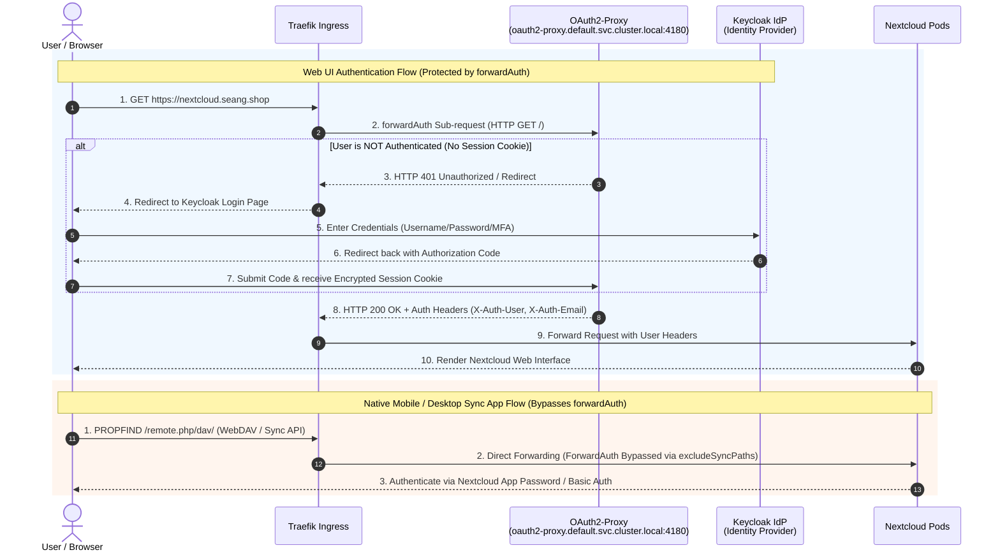

# Nextcloud Cluster Authentication Architecture

This document describes the enterprise-grade Single Sign-On (SSO) and Perimeter Defense authentication architecture for the Nextcloud Kubernetes cluster, utilizing **Keycloak**, **OAuth2-Proxy**, and **Traefik `forwardAuth`**.

---

## 1. Overview

The authentication system employs a **Zero-Trust Perimeter Defense** model:
- **Keycloak** acts as the central Identity Provider (IdP), storing user accounts, passwords, MFA, and integration with Enterprise Active Directory / LDAP.
- **OAuth2-Proxy** acts as the authentication gateway and session manager inside the cluster.
- **Traefik Ingress Controller** intercepts all incoming web traffic at the ingress boundary and uses `forwardAuth` to verify sessions with `OAuth2-Proxy` before allowing requests to reach Nextcloud.
- **Desktop & Mobile Apps** bypass `forwardAuth` for sync endpoints (`/remote.php`, `/status.php`, `/.well-known`, `/ocs`), allowing native App Passwords and WebDAV authentication to function seamlessly.

---

## 2. System Architecture Diagram



---

## 3. Kubernetes Deployment Topology

All components reside inside the Kubernetes cluster for security, high availability, and low latency:

```
┌────────────────────────────────────────────────────────────────────────────────────────┐
│                                KUBERNETES CLUSTER                                      │
│                                                                                        │
│  ┌────────────────────────┐         ┌───────────────────────────────────────────────┐  │
│  │     Keycloak Pods      │ ◄────── │             oauth2-proxy Pods                 │  │
│  │   (Identity Provider)  │  OIDC   │   Namespace: default                          │  │
│  │                        │         │   Service: oauth2-proxy (Port: 4180)          │  │
│  └────────────────────────┘         └───────────────────────────────────────────────┘  │
│                                                             ▲                          │
│                                                  forwardAuth│                          │
│                                                             ▼                          │
│  ┌────────────────────────┐         ┌───────────────────────────────────────────────┐  │
│  │     Nextcloud Pods     │ ◄────── │          Traefik Ingress Controller           │  │
│  │  (Application Backend) │         │  Middleware: nextcloud-oauth2-forward-auth    │  │
│  └────────────────────────┘         └───────────────────────────────────────────────┘  │
└────────────────────────────────────────────────────────────────────────────────────────┘
```

---

## 4. Component Breakdown & Responsibilities

| Component | Service Address / Namespace | Primary Responsibility |
| :--- | :--- | :--- |
| **Keycloak** | `https://keycloak.seang.shop` | **Identity Provider (IdP)**. Stores users, handles password policies, 2FA/MFA, social logins, and syncs with Active Directory / LDAP. |
| **OAuth2-Proxy** | `http://oauth2-proxy.default.svc.cluster.local:4180` | **Auth Gateway / Bridge**. Translates Traefik `forwardAuth` sub-requests into OIDC standard flows with Keycloak. Manages browser session cookies. |
| **Traefik `forwardAuth`** | Cluster-wide Middleware | **Perimeter Gatekeeper**. Intercepts incoming web traffic and queries `oauth2-proxy` before routing traffic to Nextcloud. |
| **Nextcloud** | Internal Service | **Application**. Serves files, calendar, contacts, and collaboration tools. |

---

## 5. Configuration Guide

### Step 1: Deploy Keycloak
1. Create an OIDC Realm in Keycloak (e.g., `enterprise-realm`).
2. Create a Client in Keycloak for `oauth2-proxy`:
   - **Client ID:** `oauth2-proxy`
   - **Client Protocol:** `openid-connect`
   - **Access Type:** `confidential`
   - **Valid Redirect URIs:** `https://nextcloud.seang.shop/oauth2/callback`
3. Note the generated **Client Secret**.

---

### Step 2: Deploy `oauth2-proxy`

Deploy `oauth2-proxy` to the `default` namespace with port `4180` exposed via service `oauth2-proxy`:

```yaml
# oauth2-proxy-values.yaml
config:
  clientID: "oauth2-proxy"
  clientSecret: "YOUR_KEYCLOAK_CLIENT_SECRET"
  cookieSecret: "GENERATED_32_BYTE_BASE64_SECRET" # Generate via: openssl rand -base64 32 | head -c 32 | base64

extraArgs:
  provider: "oidc"
  oidc-issuer-url: "https://keycloak.seang.shop/realms/enterprise-realm"
  email-domain: "*"
  upstreams: "file:///dev/null"
  pass-user-headers: true
  set-xauthrequest: true
  cookie-secure: true
  cookie-domain: ".seang.shop"

service:
  portNumber: 4180
```

Install via Helm:
```bash
helm install oauth2-proxy oauth2-proxy/oauth2-proxy \
  --namespace default \
  -f oauth2-proxy-values.yaml
```

---

### Step 3: Deploy Nextcloud Chart

Ensure `values.yaml` in your Nextcloud Helm chart has `forwardAuth` enabled pointing to the `oauth2-proxy` service:

```yaml
# values.yaml
traefik:
  enabled: true
  middlewares:
    forwardAuth:
      enabled: true
      address: "http://oauth2-proxy.default.svc.cluster.local:4180"
      trustForwardHeader: true
      authResponseHeaders:
        - "X-Auth-User"
        - "X-Auth-Email"
        - "Authorization"
      excludeSyncPaths: true # Crucial for desktop/mobile app compatibility
```

Install/Upgrade Nextcloud:
```bash
helm upgrade --install nextcloud ./ -f values.yaml
```

---

## 6. Sync Path Exclusion for Native Apps

Mobile apps (iOS/Android) and Desktop sync clients do not support OAuth2 browser redirect flows out of the box for WebDAV sync. 

To solve this, the Traefik IngressRoute template splits incoming traffic into two routes:
1. **Web UI Route:** Protected by `forwardAuth` middleware.
2. **Sync Route:** Matches `/remote.php`, `/status.php`, `/.well-known`, and `/ocs` paths. This route **bypasses `forwardAuth`**, allowing native clients to authenticate directly with Nextcloud using App Passwords.

---

## 7. Diagnostics & Troubleshooting

| Symptom | Cause | Solution |
| :--- | :--- | :--- |
| **HTTP 500 / 502 on Web UI** | `oauth2-proxy` pod is down or service name in `default` namespace is unreachable. | Check pods: `kubectl get pods -n default -l app.kubernetes.io/name=oauth2-proxy`. Check service port `4180`. |
| **Infinite Login Loop** | Keycloak redirect URI mismatch or invalid `cookieSecret`. | Verify Keycloak client redirect URI matches `https://<domain>/oauth2/callback`. |
| **Desktop App Sync Fails** | `excludeSyncPaths` is set to `false`. | Ensure `traefik.middlewares.forwardAuth.excludeSyncPaths: true` is set in `values.yaml`. |
