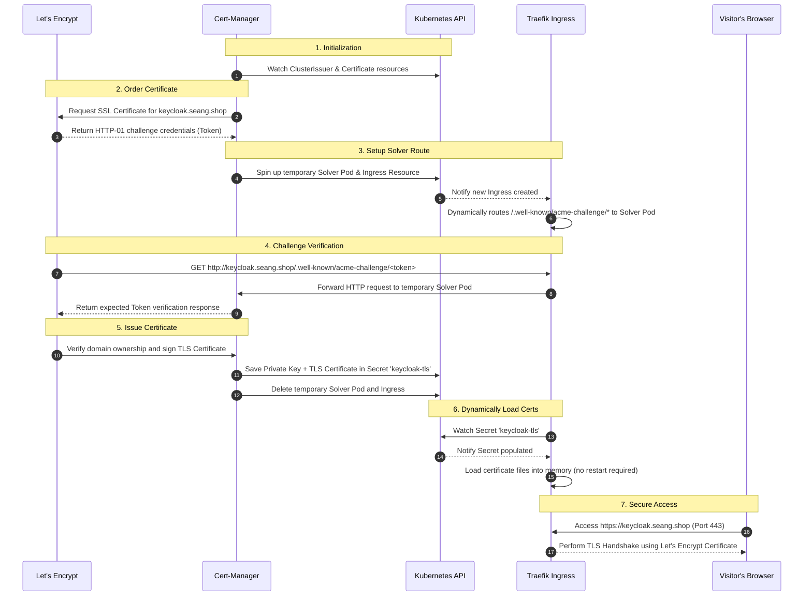

# Traefik DaemonSet Installation with Helm

## 2. Add the Traefik Helm repository

```bash
helm repo add traefik https://traefik.github.io/charts
helm repo update
```

The official Traefik Helm chart uses this repository.

---

## 3. Create the namespace

```bash
kubectl create namespace traefik
```

---

## 4. Install Traefik

From the directory containing `traefik-values.yaml`:

```bash
helm install traefik traefik/traefik \
  --namespace traefik \
  --values traefik-values.yaml \
  --wait
```

This installs Traefik using your custom `traefik-values.yaml`.

---

## 5. Verify the DaemonSet

Check the DaemonSet:

```bash
kubectl get daemonset -n traefik
```

You should see something similar to:

```text
NAME      DESIRED   CURRENT   READY
traefik   3         3         3
```

The number `3` assumes you have three eligible Kubernetes nodes.

---

## 6. Verify Traefik Pods

```bash
kubectl get pods -n traefik -o wide
```

You should have **one Traefik pod on each eligible node**.

For example:

```text
NAME             READY   STATUS    NODE
traefik-xxxxx    1/1     Running   node-01
traefik-yyyyy    1/1     Running   node-02
traefik-zzzzz    1/1     Running   node-03
```

---

## 7. Verify Host Ports

Because Traefik is configured to use `hostPort`, verify that ports `80` and `443` are configured:

```bash
kubectl get pods -n traefik -o yaml | grep -A5 hostPort
```

You should see:

```text
hostPort: 80
hostPort: 443
```

This means each Traefik pod can listen directly on the Kubernetes node's:

- TCP port `80` for HTTP
- TCP port `443` for HTTPS

---

## Architecture

```text
                    Kubernetes Cluster
                           |
          +----------------+----------------+
          |                |                |
       node-01          node-02          node-03
          |                |                |
       Traefik           Traefik          Traefik
       :80 :443          :80 :443         :80 :443
          |                |                |
          +----------------+----------------+
                           |
                    Kubernetes Service
                           |
                    Application Pods
```

## Important

Make sure ports `80` and `443` are not already being used by another service on the Kubernetes nodes.

If you are using **K3s**, check whether the built-in Traefik is already installed before deploying another Traefik instance. Two Traefik instances cannot both bind to the same host ports on the same node.

---

## TLS Certificate Flow (Traefik + cert-manager)

The sequence below details how a certificate is requested, validated, issued, and served securely:



### Detailed Step-by-Step Walkthrough

1. **Deploying the Infrastructure (`ClusterIssuer`)**:
   We configure a `ClusterIssuer` (referencing your email and Let's Encrypt ACME URL). Cert-manager reads this global config to establish a secure account session with Let's Encrypt.
2. **Declaring the Request (`Certificate`)**:
   The Helm chart deploys a `Certificate` Custom Resource. It references the domain `keycloak.seang.shop` and specifies the target Kubernetes Secret (`keycloak-tls`).
3. **Creating the Let's Encrypt Order**:
   Cert-manager detects the `Certificate` resource and triggers a request to Let's Encrypt. Let's Encrypt responds with a unique challenge token to prove domain ownership.
4. **Deploying the Solver**:
   Cert-manager spins up a temporary Web Server pod (called the `solver pod`) and creates a temporary `Ingress` rule in Kubernetes.
5. **Configuring the Ingress Controller**:
   Traefik detects the temporary `Ingress` rule and automatically updates its routing tables to map requests on path `/.well-known/acme-challenge/*` directly to the solver pod.
6. **Verifying Domain Ownership**:
   Let's Encrypt servers make an HTTP request to `http://keycloak.seang.shop/.well-known/acme-challenge/<token>`. Traefik routes this request to the solver pod. The pod responds with the correct validation token, proving you control the domain's DNS.
7. **Saving the Certificate**:
   Let's Encrypt confirms validation, signs the TLS certificate, and returns it. Cert-manager stores the TLS certificate and private key inside the target secret (`keycloak-tls`), and cleans up (deletes) the solver pod and temporary ingress.
8. **Dynamic SSL Reload**:
   Traefik's hot-reload engine watches the `keycloak-tls` secret. Once it is populated, Traefik immediately loads it into memory without causing any service interruption.
9. **Secure HTTPS Session**:
   When visitors access `https://keycloak.seang.shop`, Traefik handles the TLS handshake on port 443 using the Let's Encrypt certificate, encrypting all traffic.


